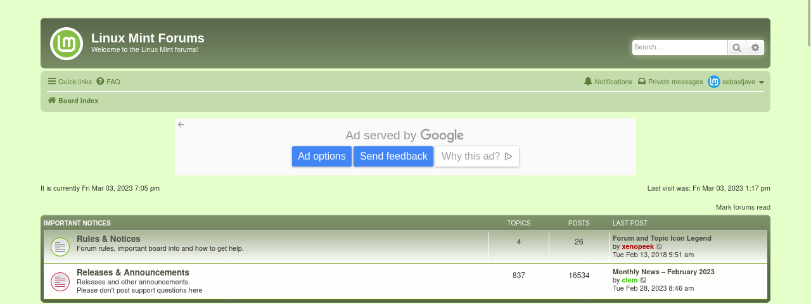

CURRENT DEFAULT MINTY:

NEW PROSILVER-LM:

# Prosilver-lm: phpBB theme for LinuxMint

This Prosilver-lm is a custom tailored new look and feel for the LinuxMint forums. The LinuxMint forums are powered by [phpBB®](https://www.phpbb.com/) and this Prosilver-lm is a phpBB theme. This Prosilver-lm is what we call a "child" theme. It is based on the Prosilver parent theme. The Prosilver theme is the standard, default theme on phpBB. It is trustworthy. And this child theme here is just a small package. It only contains the modifications made on top of this standard and trustworthy Prosilver theme.

Don't get overwhelmed by the amount of files here. Most of these files are not part of the theme itself: preview, favicon, etc. You don't really need these. The files you need to look at are:

* template/ (directory)
* theme/ (directory)
* style.cfg

As you can see, there aren't many files in there. And that's all you need !

This Prosilver-lm being just a small child theme, this means it can easily and quickly be reviewed. And tested. And approved. And it won't be hard to merge the occasional updates coming from the parent theme. This child and parent theme structure is the most efficient and recommended way to work, as stated by phpBB. You can read all about phpBB theme creation on:

* https://www.phpbb.com/styles/installing/#a-editing (introduction)
* https://www.phpbb.com/styles/create/ (complete tutorial)

**See this Prosilver-lm for real ! Visit** https://sebastjava.com/forums/  

This is a forum showcase, powered by phpBB and featuring this Prosilver-lm. But that's only for a limited time. This website is just a temporary one and will probably be deleted on Jan 21, 2024.

### Design improvements: colours

Here there is a need for a coherent, consistent brand image across all websites. The colour gradient used for the banner is similar to the one found on LinuxMint's [main website](https://linuxmint.com/). And the green background on forum categories is the same as the one on the fixed navigation bar appearing as you scroll down on this main website. And other colour tints got created based on this colour palette found on the main website.

But it can't be all just green tints on green tints. There is a need for neutral greys or soft blues. Here, the background body is made of a light and neutral grey. And All the forums posts are made of the same white background and dark grey foreground text. Thus, the contrast is always the best one, very similar to the Mint-Y theme: `#333333` on `#FFFFFF`. And the focus is naturally driven onto the inner posts, with their white backgrounds, as opposed to the outer grey body.

### Design improvements: page header and logo

* The "Lm" logo and "linuxmint forums" text are grouped together into one single SVG file. That's precision typography and alignments based on a variable weight [Exo 2 font](https://fonts.google.com/specimen/Exo+2?query=exo&vfonly=true). But don't worry, that text got converted to paths, so there is no need to download any font. No compatibility issues.
* The site name and site description are not getting displayed anymore. So there is no redundancy with the logo, which already contains this nice and precise "linuxmint forums" typography.
* The logo and custom typography gets displayed on every devices, including on cellular phones, but with a reduced size for those, of course.
* Those two "headerbar" and "navbar", on top of every page, are now nicely grouped together. This makes it look less modular. And this grouping is further enhanced with a common background "banner". But this "navbar" gets a semi-transparent white overlay, for a better readability.
* This background banner is made of abstract rings. It fits with the logo. This could evolve from time to time, but i will probably keep it abstract, simple, uncluttered.

### Design improvements: miscellaneous

* There are less colour gradients being used. It feels lighter, uncluttered, zen.
* The URL links got a bit darker, stronger.
* The posted pictures are all aligned to the middle, including the thumbnails. Before, it felt unbalanced, all the weight was on the left.

### Local tests (optional)

If you want to test this Prosilver-lm on your local computer before uploading it, you will need those:

* A local LAMPP or XAMPP installation. These are Apache distributions containing MariaDB, PHP, and Perl. It is a complete kit that will allow you to make a local phpBB installation. This way you can quickly test everything before uploading on your web server. Find all about this there: https://www.phpbb.com/support/docs/en/3.2/kb/article/installing-and-setting-up-your-own-web-server/
* A local and up-to-date phpBB installation. This Prosilver-lm was created on the latest stable phpBB release, version 3.3.10: https://www.phpbb.com/downloads/3.3/install

### Installation instructions (for LinuxMint administrators only!)

1. BACKUP everything. The most important is your entire database.
1. Update your phpBB forum software to the latest version: https://www.phpbb.com/downloads/3.3/update.
1. Make sure your `styles/prosilver` directory is unaltered. You should never modify this one, but create child themes instead. Else, just replace it with a fresh extract from the `phpBB-latest-version.zip`.
1. Download or clone this prosilver-lm directory from here on [SebastJava/prosilver-lm](https://github.com/SebastJava/prosilver-lm). (Click on that green "Code" button on top-right ↗)
1. Upload it onto your server at https://forums.linuxmint.com/styles/prosilver-lm/ (SFTP connection and administrator username and password required.)
1. Once the style is uploaded, navigate to the board's ACP to Customize -> Install Styles. You should see your recently uploaded styles listed (assuming you uploaded it to the correct location and the style is valid), with an option to "Install style". Simply click it and the installation is complete! [More info here](https://www.phpbb.com/styles/installing/).
1. In ACP > Customize > Styles section, you should deactivate the parent Prosilver theme. This way, this parent is still available for this Prosilver-lm to work, but the forum users cannot choose this Prosilver parent, so they won't end up with the phpBB logo replacing the LinuxMint logo...
1. You should also go to ACP > General > Board settings section, and check your Board style settings.

The official and complete installation instructions can be found [here on phpBB](https://www.phpbb.com/styles/installing/).

### FlatUI Smilies update

1. The smilies could be updated too! The smilies are located at https://forums.linuxmint.com/images/smilies.
2. You could replace the default smilies with these new ones here: https://www.phpbb.com/customise/db/style/flatui_smilies/ Just follow the quick and easy instructions from there. Having trouble? The procedure is made even more simple now. You should be able to find my update topic about this procedure on https://www.phpbb.com/customise/db/style/flatui_smilies/support.

### Favicon update

It would be better to use the simple "Lm" path, without any background circle. This way the favicon would not look so small.

Also, it would be better to have favicons generated for all browsers on all platforms. Using https://realfavicongenerator.net/ a bunch of various files would be created, for all browsers on all platforms.

But for now we will just go with the standard `favicon.ico` as found on the main website.

### Documentation and credits
Many information sources and tutorials helped into creating this Prosilver-lm:

* [phpBB](https://www.phpbb.com)
* [www.phpbb.com/styles/installing/](https://www.phpbb.com/styles/installing/)
* [www.phpbb.com/styles/create/](https://www.phpbb.com/styles/create/)
* [phpBB/support](https://www.phpbb.com/support/docs/en/3.3/kb/)
* https://www.phpbb.com/support/docs/en/3.2/kb/article/installing-and-setting-up-your-own-web-server/
* https://linuxhint.com/how-to-install-xampp-server-on-linux-mint-20/
* https://www.apachefriends.org/index.html
* [Xampp Panel Menu](https://cinnamon-spices.linuxmint.com/applets/view/146)
* [CSS Tutorial](https://www.w3schools.com/css/default.asp)
* [CSS Reference](https://www.w3schools.com/cssref/index.php)